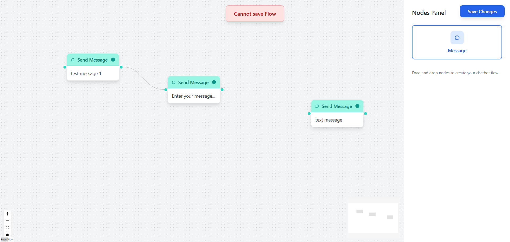

# BiteSpeed Chatbot Flow Builder

A modern, extensible chatbot flow builder application built with React and React Flow. This application allows users to create, edit, and manage chatbot conversation flows through an intuitive drag-and-drop interface.

   

 
  

## 🚀 Features

### Core Functionality
- **Drag & Drop Interface**: Intuitive node creation by dragging from the nodes panel
- **Visual Flow Builder**: Connect nodes with edges to create conversation flows
- **Real-time Editing**: Edit node content with instant visual feedback
- **Flow Validation**: Smart validation prevents invalid flow configurations
- **Local Storage**: Automatic saving of flows to browser localStorage
- **Responsive Design**: Works seamlessly across desktop and tablet devices

### Node System
- **Text Nodes**: Send message nodes with customizable content
- **Connection Handles**: 
  - Source handles (right side) - one outgoing connection per handle
  - Target handles (left side) - multiple incoming connections allowed
- **Visual Feedback**: Selected nodes show blue border highlighting

### User Interface
- **Nodes Panel**: Drag and drop interface for adding new nodes
- **Settings Panel**: Edit selected node properties with live preview
- **Save System**: Visual feedback for successful saves and error states
- **Clean Design**: Modern UI matching professional design standards

## 🛠️ Tech Stack

### Frontend Framework
- **React 18.3.1** - Modern React with hooks and functional components
- **TypeScript 5.5.3** - Type-safe development with full IntelliSense support
- **Vite 5.4.2** - Lightning-fast build tool and development server

### UI & Styling
- **Tailwind CSS 3.4.1** - Utility-first CSS framework for rapid styling
- **Lucide React 0.344.0** - Beautiful, customizable SVG icons
- **PostCSS 8.4.35** - CSS processing with autoprefixer

### Flow Builder
- **@xyflow/react 12.8.4** - Powerful React Flow library for node-based interfaces
- **React Flow Controls** - Built-in zoom, pan, and minimap controls
- **Custom Node Types** - Extensible architecture for different node types

### Development Tools
- **ESLint 9.9.1** - Code linting with React-specific rules
- **TypeScript ESLint** - TypeScript-aware linting rules
- **React Hooks ESLint Plugin** - Hooks-specific linting rules

## 📁 Project Structure

```
src/
├── components/
│   ├── nodes/
│   │   └── TextNode.tsx              # Custom text message node component
│   ├── panels/
│   │   ├── NodesPanel.tsx            # Drag & drop nodes panel
│   │   └── SettingsPanel.tsx         # Node editing settings panel
│   ├── ChatbotFlowBuilder.tsx        # Main flow builder component
│   ├── SaveButton.tsx                # Save functionality with visual feedback
│   └── ErrorNotification.tsx         # Error state notification component
├── App.tsx                           # Root application component
├── main.tsx                          # Application entry point
├── index.css                         # Global styles and Tailwind imports
└── vite-env.d.ts                     # Vite type definitions

Configuration Files:
├── package.json                      # Dependencies and scripts
├── tsconfig.json                     # TypeScript configuration
├── tsconfig.app.json                 # App-specific TypeScript config
├── tsconfig.node.json                # Node-specific TypeScript config
├── vite.config.ts                    # Vite build configuration
├── tailwind.config.js                # Tailwind CSS configuration
├── postcss.config.js                 # PostCSS configuration
├── eslint.config.js                  # ESLint configuration
└── index.html                        # HTML entry point
```

## 🏗️ Architecture

### Component Architecture
The application follows a modular, component-based architecture:

- **ChatbotFlowBuilder**: Main container managing flow state and interactions
- **Custom Nodes**: Extensible node system supporting different message types
- **Panel System**: Switchable sidebar panels for different functionalities
- **State Management**: React hooks for local state with localStorage persistence

### Data Flow
1. **Node Creation**: Drag from NodesPanel → Drop on canvas → Create new node
2. **Node Selection**: Click node → Show SettingsPanel → Edit properties
3. **Flow Validation**: Save button → Validate connections → Show success/error
4. **Persistence**: Successful save → Store in localStorage → Visual confirmation

### Extensibility
The architecture is designed for easy extension:
- **New Node Types**: Add to `nodeTypes` object and create component
- **Additional Panels**: Extend panel system with new functionality
- **Custom Validation**: Modify save logic for different flow rules
- **Styling**: Tailwind classes for consistent design system

## 🚦 Getting Started

### Prerequisites
- Node.js 16.0 or higher
- npm or yarn package manager

### Installation

1. **Clone the repository**
   ```bash
   git clone <repository-url>
   cd ChatbotBiteSpeed
   ```

2. **Install dependencies**
   ```bash
   npm install
   ```

3. **Start development server**
   ```bash
   npm run dev
   ```

4. **Open in browser**
   Navigate to `http://localhost:5173`

### Available Scripts

- `npm run dev` - Start development server with hot reload
- `npm run build` - Build production-ready application
- `npm run preview` - Preview production build locally
- `npm run lint` - Run ESLint for code quality checks

## 📖 Usage Guide

### Creating Your First Flow

1. **Add Nodes**: Drag the "Message" node from the right panel onto the canvas
2. **Connect Nodes**: Click and drag from a node's right handle to another node's left handle
3. **Edit Content**: Click on any node to open the settings panel and edit the message text
4. **Save Flow**: Click "Save Changes" to validate and save your flow

### Flow Validation Rules

- **Single Node**: Flows with one node can always be saved
- **Multiple Nodes**: All nodes except one must have incoming connections
- **Error State**: If validation fails, an error notification appears for 3 seconds

### Keyboard Shortcuts

- **Delete**: Select node and press Delete key to remove
- **Escape**: Deselect current selection
- **Space + Drag**: Pan around the canvas

## 🔧 Customization

### Adding New Node Types

1. Create a new node component in `src/components/nodes/`
2. Add the node type to the `nodeTypes` object in `ChatbotFlowBuilder.tsx`
3. Update the `NodesPanel.tsx` to include the new node type
4. Extend the settings panel for node-specific properties

### Styling Customization

The application uses Tailwind CSS for styling. Key design tokens:

- **Primary Colors**: Blue (buttons), Teal (nodes), Gray (backgrounds)
- **Spacing**: 8px grid system for consistent spacing
- **Typography**: System font stack with multiple weights
- **Shadows**: Layered shadow system for depth

### Storage Customization

Currently uses localStorage. To integrate with a backend:

1. Replace localStorage calls in `handleSave` function
2. Add API integration for flow persistence
3. Implement loading functionality for saved flows

## 🤝 Contributing

1. Fork the repository
2. Create a feature branch (`git checkout -b feature/amazing-feature`)
3. Commit your changes (`git commit -m 'Add amazing feature'`)
4. Push to the branch (`git push origin feature/amazing-feature`)
5. Open a Pull Request

## 📝 License

This project is licensed under the MIT License - see the LICENSE file for details.

## 🙏 Acknowledgments

- **React Flow** - For the excellent flow builder foundation
- **Tailwind CSS** - For the utility-first CSS framework
- **Lucide** - For the beautiful icon set
- **Vite** - For the fast development experience

---

**Built with ❤️ for BiteSpeed Frontend Task**